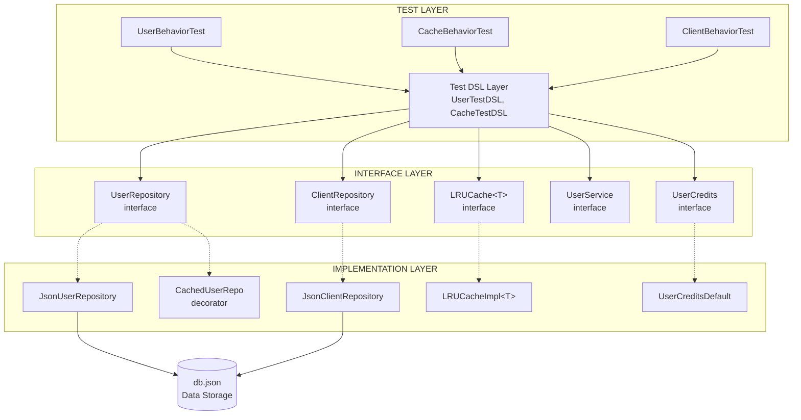
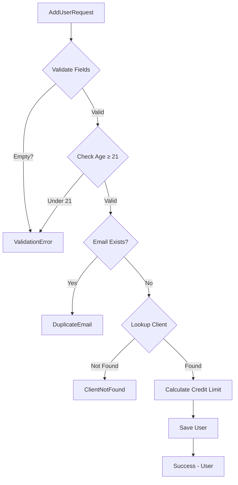
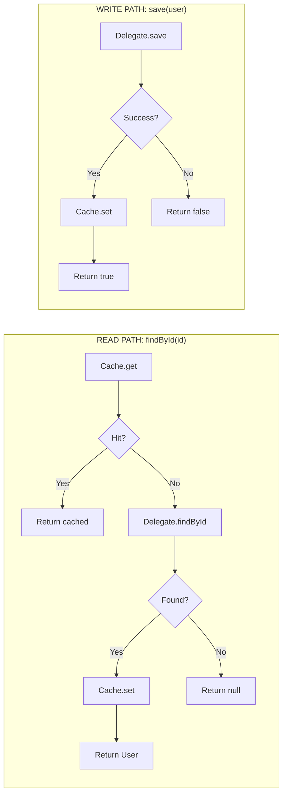

# Architecture Guide

This document provides a developer-focused breakdown of the design patterns, test architecture, and control flow used in this BDD-refactored codebase.

---

## Overview

This project demonstrates a **Behavior-Driven Development (BDD)** approach where tests are written against interfaces rather than implementations. The architecture adheres to SOLID principles:

- **S**ingle Responsibility: Each class has one job
- **O**pen/Closed: New credit policies can be added without modifying existing code
- **L**iskov Substitution: All repository implementations are interchangeable
- **I**nterface Segregation: Focused, minimal interfaces
- **D**ependency Inversion: High-level modules depend on abstractions

---

## Layered Architecture



---

## Control Flow Diagrams

### User Addition Flow



### Cache-Aside Pattern



---

## File Structure

```
src/
├── main/kotlin/com/speechify/
│   ├── CacheLimitsConfig.kt           # Cache configuration
│   ├── LRUCacheInterface.kt           # Cache interface
│   ├── LRUCacheProvider.kt            # Cache factory
│   ├── cache/
│   │   └── LRUCacheImpl.kt            # LRU implementation
│   ├── domain/
│   │   └── Models.kt                  # User, Client, ClientType
│   ├── repository/
│   │   ├── Repositories.kt            # Interfaces
│   │   ├── JsonUserRepository.kt      # JSON persistence
│   │   ├── JsonClientRepository.kt    # JSON persistence
│   │   └── CachedUserRepository.kt    # Caching decorator
│   ├── service/
│   │   ├── UserMisc.kt                # Interfaces & DTOs
│   │   ├── UserDefault.kt      # Implementation
│   │   └── UserValidator.kt           # Validation logic
│   └── policy/
│       ├── UserCredits.kt            # Interface
│       └── UserCreditsDefault.kt     # Implementation
│
└── test/kotlin/
    ├── dsl/
    │   ├── UserTestDSL.kt             # User test DSL
    │   └── CacheTestDSL.kt            # Cache test DSL
    ├── drivers/
    │   └── InMemoryTestDriver.kt      # Test doubles
    ├── fixtures/
    │   └── TestFixtures.kt            # Test data builders
    └── behavior/
        ├── UserValidationBehaviorTest.kt
        ├── CreditLimitBehaviorTest.kt
        ├── CacheBehaviorTest.kt
        ├── CacheIntegrationBehaviorTest.kt
        └── ClientRepositoryBehaviorTest.kt
```

---

## Gang of Four Patterns

| File | Pattern | Description |
| ---- | ------- | ----------- |
| `LRUCacheProvider.kt` | **Factory** | Encapsulates creation of `LRUCacheImpl` instances |
| `UserCredits.kt` | **Strategy** (Interface) | Defines contract for credit limit algorithms |
| `UserCreditsDefault.kt` | **Strategy** (Impl) | Implements credit logic based on `ClientType` |
| `CachedUserRepository.kt` | **Decorator** | Wraps `UserRepository` to add transparent caching |
| `UserDefault.kt` | **Facade** | Orchestrates repositories, policies, and validators |
| `Repositories.kt` | **Repository** | Abstracts data persistence |
| `UserTestDSL.kt` | **Template Method** | Enforces Given-When-Then test structure |
| `TestFixtures.kt` | **Builder** | Fluent test object construction via default params |
| `AddUserResult` | **Sealed Class** | Type-safe exhaustive result handling |

---

## BDD Test Specifications

### User Validation Tests

| Test Case | Given | When | Then |
|-----------|-------|------|------|
| `rejects user under 21` | User born < 21 years ago | Adding user | ValidationError |
| `accepts user exactly 21` | User born exactly 21 years ago | Adding user | Success |
| `accepts user over 21` | User born > 21 years ago | Adding user | Success |
| `rejects duplicate email` | User with email exists | Adding user | DuplicateEmail |
| `rejects empty firstname` | Request with empty firstname | Adding user | ValidationError |
| `rejects empty surname` | Request with empty surname | Adding user | ValidationError |
| `rejects empty email` | Request with empty email | Adding user | ValidationError |
| `rejects invalid client` | No client with given ID | Adding user | ClientNotFound |

### Credit Limit Tests

| Test Case | Given | When | Then |
|-----------|-------|------|------|
| `VeryImportantClient has no limit` | Client type = VERY_IMPORTANT | Adding user | hasCreditLimit = false |
| `ImportantClient gets 20000` | Client type = IMPORTANT | Adding user | creditLimit = 20000 |
| `Regular client gets 10000` | Client type = REGULAR | Adding user | creditLimit = 10000 |

### Cache Behavior Tests

| Test Case | Given | When | Then |
|-----------|-------|------|------|
| `stores and retrieves` | Empty cache | Store item | Item retrievable |
| `returns null for missing` | Empty cache | Get non-existent | Returns null |
| `evicts LRU at capacity` | Cache full (A, B), A accessed | Store C | B evicted |
| `update refreshes access` | Cache with item | Update same key | No eviction |
| `get refreshes access` | Cache full | Get oldest item | Item not evicted next |

### Cache Integration Tests

| Test Case | Given | When | Then |
|-----------|-------|------|------|
| `cache miss fetches from DB` | User in DB, not in cache | Get user | DB called, user cached |
| `cache hit skips DB` | User in cache | Get user | DB not called |
| `save updates cache` | User saved | Get user | Served from cache |
| `update propagates to cache` | User in cache | Update user | Cache has new value |

---

## Key Design Decisions

1. **Tests against interfaces** - No test directly instantiates an implementation
2. **DSL for readability** - Given/When/Then methods make tests self-documenting
3. **Immutable models** - All domain objects use `val` and `data class`
4. **Sealed results** - `AddUserResult` enables exhaustive `when` expressions
5. **Decorator for caching** - Cache layer is transparent and swappable
6. **Strategy for policies** - Credit rules can be changed without touching services

---

## Related Documentation

- [BDD-principles.md](1-Dave-Farley-BDD-principles.md) - Dave Farley's BDD testing philosophy
