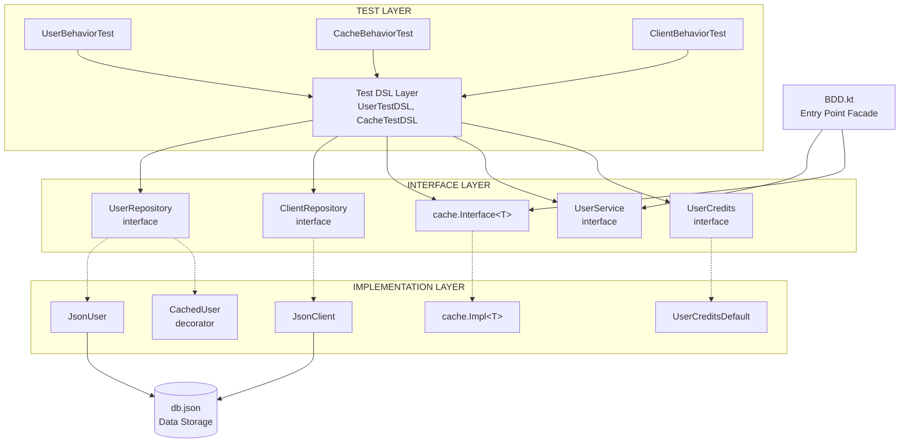
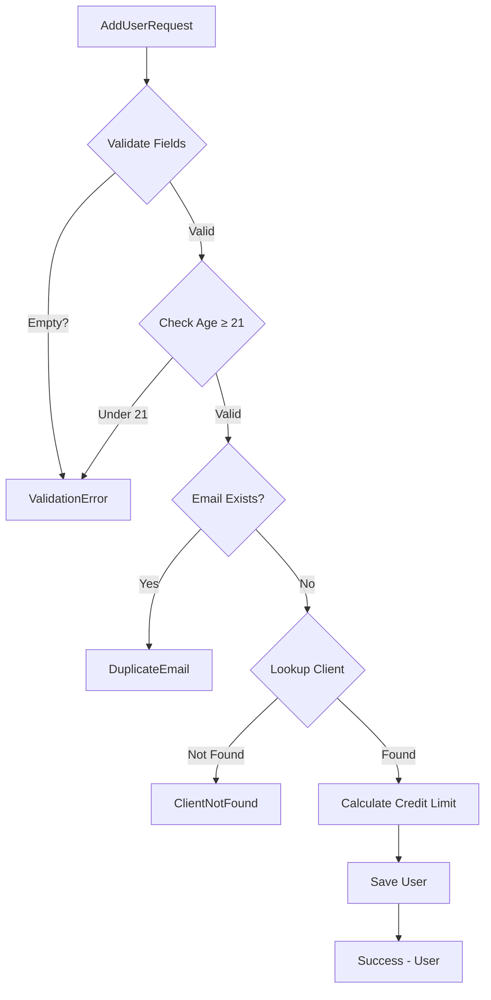
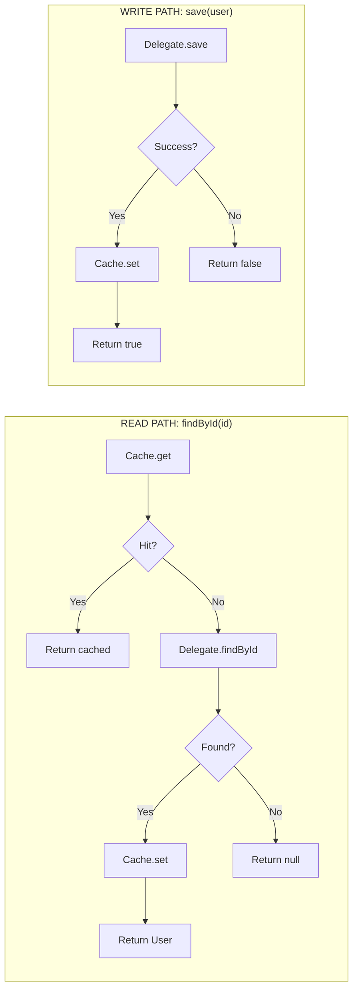

# Architecture Features & Summary

---

## File Structure

```
src/
├── main/kotlin/
│   ├── Core.kt                        # Entry point facade
│   ├── cache/
│   │   ├── Config.kt                  # Cache configuration
│   │   ├── Interface.kt               # Cache interface
│   │   ├── Provider.kt                # Cache factory
│   │   └── Impl.kt                    # LRU implementation
│   ├── domain/
│   │   └── Models.kt                  # User, Client, ClientType
│   ├── repository/
│   │   ├── Interfaces.kt              # Interfaces
│   │   ├── JsonUser.kt                # JSON persistence
│   │   ├── JsonClient.kt              # JSON persistence
│   │   └── CachedUser.kt              # Caching decorator
│   ├── service/
│   │   ├── UserMisc.kt                # Interfaces & DTOs
│   │   ├── UserDefault.kt             # Implementation
│   │   └── UserValidator.kt           # Validation logic
│   └── policy/
│       ├── UserCredits.kt             # Interface
│       └── UserCreditsDefault.kt      # Implementation
│
└── test/kotlin/
    ├── dsl/
    │   ├── UserTestDSL.kt             # User test DSL
    │   └── CacheTestDSL.kt            # Cache test DSL
    ├── drivers/
    │   └── InMemoryTestDriver.kt      # Test doubles
    ├── fixtures/
    │   └── TestFixtures.kt            # Test data builders
    └── tests/
        ├── UserValidationBehaviorTest.kt
        ├── CreditLimitBehaviorTest.kt
        ├── CacheBehaviorTest.kt
        ├── CacheIntegrationBehaviorTest.kt
        └── ClientRepositoryBehaviorTest.kt
```

---

## Layered Architecture



---

## Control Flow Diagrams

### User Addition Flow



### Cache-Aside Pattern



---

## What This Project Demonstrates

## **One** Nice BDD Design

```
Test Cases (declarative, behavior-focused)
         │
         ▼
    Test DSL (semantic abstraction layer)
         │
         ▼
  Protocol Drivers (in-memory implementations)
         │
         ▼
   System Under Test
```

## **Two** Core Principles

### 2.1 Always have User Friendly Facade for a Quick Start

The `BDD.kt` facade provides easy access to the entire API:

```kotlin
// Simple usage - one import, one line setup
val service = BDD.createUserService()

val result = service.addUser(BDD.addUserRequest(
    firstname = "John",
    surname = "Doe",
    email = "john@example.com",
    dateOfBirth = LocalDate.of(1990, 1, 1),
    clientId = "client-123"
))

when (result) {
    is AddUserResult.Success -> println("Created: ${result.user}")
    is AddUserResult.ValidationError -> println("Error: ${result.reason}")
    is AddUserResult.DuplicateEmail -> println("Email exists")
    is AddUserResult.ClientNotFound -> println("Invalid client")
}
```

### 2.2 Always have Thorough BDD Tests for Durable & Reliable Use Long-term

| Test Suite | Tests | Focus |
|------------|-------|-------|
| LruCacheTest | 9 | Cache mechanics |
| UserValidationBehaviorTest | 8 | Business rules |
| CreditLimitBehaviorTest | 3 | Credit policies |
| CacheBehaviorTest | 6 | Cache behavior |
| CacheIntegrationBehaviorTest | 5 | Cache + repository |
| ClientRepositoryBehaviorTest | 5 | Data access |
| **Total** | **36** | |

---

## **Three** Production Features

### 3.1 Easy Configuration

```kotlin
val service = BDD.createUserService(
    cacheSize = 100,           // LRU cache capacity
    dbPath = "path/to/db.json", // Data file location
    minimumAge = 21            // Age validation threshold
)
```

### 3.2 Thread Safe Async/Coroutine

All service and repository methods are `suspend` functions, designed for non-blocking I/O:

- **LRU Cache**: Uses `Mutex` for coroutine-safe concurrent access
- **File I/O**: Runs on `Dispatchers.IO` for non-blocking operations
- **Safe for concurrent coroutines**: No shared mutable state without synchronization

```kotlin
// All operations are coroutine-safe
val service = BDD.createUserService()

// Use within a coroutine scope
runBlocking {
    val result = service.addUser(request)
    val user = service.getUserByEmail("john@example.com")
}
```

### 3.3 Logging (SLF4J + Logback)

Structured logging throughout with appropriate levels:

| Level | Usage |
|-------|-------|
| `INFO` | User created, user updated |
| `WARN` | Validation failures, client not found |
| `ERROR` | Save failures |
| `DEBUG` | Cache hits/misses |

---

## Gang of **Four** Patterns

| File | Pattern | Description |
| ---- | ------- | ----------- |
| `Core.kt` | **Facade** | Single entry point to the entire API |
| `cache/Provider.kt` | **Factory** | Encapsulates creation of cache instances |
| `UserCredits.kt` | **Strategy** (Interface) | Defines contract for credit limit algorithms |
| `UserCreditsDefault.kt` | **Strategy** (Impl) | Implements credit logic based on `ClientType` |
| `CachedUser.kt` | **Decorator** | Wraps `UserRepository` to add transparent caching |
| `UserDefault.kt` | **Facade** | Orchestrates repositories, policies, and validators |
| `Interfaces.kt` | **Repository** | Abstracts data persistence |
| `UserTestDSL.kt` | **Template Method** | Enforces Given-When-Then test structure |
| `TestFixtures.kt` | **Builder** | Fluent test object construction via default params |
| `AddUserResult` | **Sealed Class** | Type-safe exhaustive result handling |
