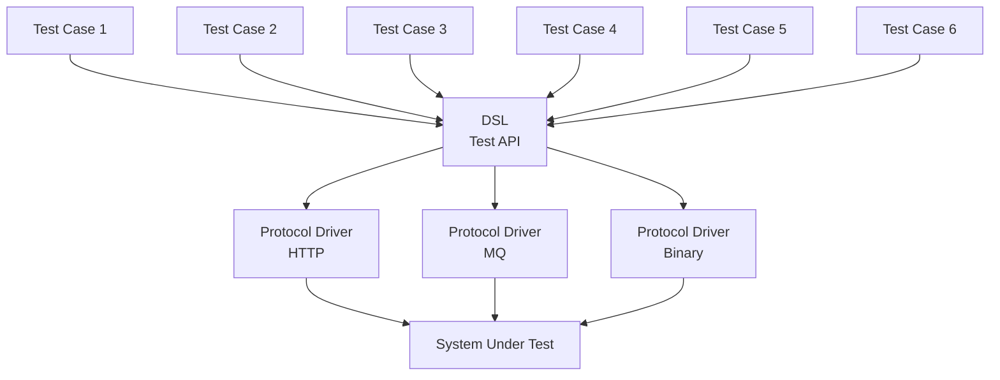

# Dave Farely's BDD Architecture Explained

`Test Cases`

Declarative, intent-focused specifications.

Do not directly interact with the system or protocols.

DSL (Domain-Specific Language)

A semantic abstraction layer.

Encodes business intent and test meaning.

Insulates tests from protocol and transport changes.

Protocol Drivers

Imperative adapters.

Translate DSL commands into concrete protocol interactions.

Multiple drivers can coexist (HTTP, messaging, binary, etc.).

System Under Test

The actual runtime system.

Only communicates via protocols, never directly with tests.

Key Architectural Properties

Tests are stable; protocol drivers are volatile.

Behavior is tested, not implementation details.

`Enable`

Readable tests

Replaceable transports

Clear separation of intent vs mechanism

## Structure of the DSL and Protocol Drivers

