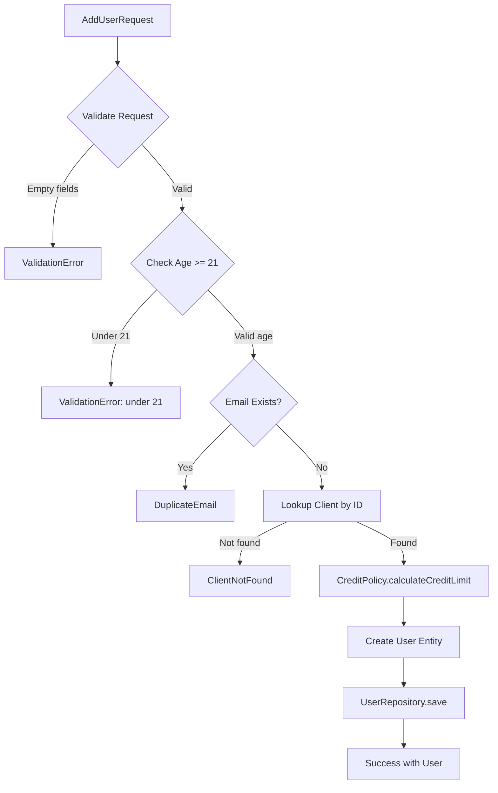
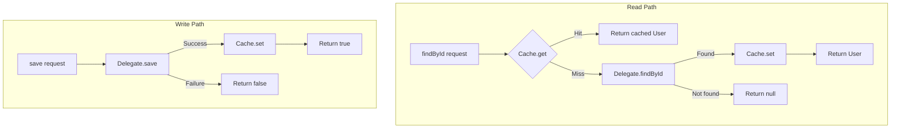

# Architecture Guide: Gang of Four Patterns & Control Flow

This document provides a developer-focused breakdown of the design patterns and control flow used in this refactored codebase.

---

## Overview

This project follows a **BDD/TDD approach** with tests written against interfaces rather than implementations. The architecture adheres to SOLID principles:

- **S**ingle Responsibility: Each class has one job
- **O**pen/Closed: New credit policies can be added without modifying existing code
- **L**iskov Substitution: All repository implementations are interchangeable
- **I**nterface Segregation: Focused, minimal interfaces
- **D**ependency Inversion: High-level modules depend on abstractions

---

## Gang of Four Patterns by File

| File | Pattern | Description |
| ---- | ------- | ----------- |
| `LRUCacheProvider.kt` | **Factory** | Encapsulates creation of `LRUCacheImpl` instances, hiding implementation details from clients |
| `CreditPolicy.kt` | **Strategy** (Interface) | Defines contract for credit limit calculation algorithms |
| `DefaultCreditPolicy.kt` | **Strategy** (Impl) | Implements credit logic based on `ClientType` (VIP, Important, Regular) |
| `CachedUserRepository.kt` | **Decorator** | Wraps `UserRepository` to add transparent caching layer using cache-aside pattern |
| `DefaultUserService.kt` | **Facade** | Orchestrates repositories, policies, and validators behind a simple `UserService` interface |
| `Repositories.kt` | **Repository** | Abstracts data persistence; implementations can be swapped (JSON, in-memory) |
| `JsonUserRepository.kt` | **Repository** (Impl) | JSON file-based persistence |
| `JsonClientRepository.kt` | **Repository** (Impl) | JSON file-based client data access |
| `UserTestDSL.kt` | **Template Method** | Enforces Given-When-Then test structure |
| `CacheTestDSL.kt` | **Template Method** | Enforces Given-When-Then structure for cache tests |
| `TestFixtures.kt` | **Builder** | Uses Kotlin default params for fluent test object construction |
| `Services.kt` (`AddUserResult`) | **Sealed Class** | Type-safe exhaustive result handling (Success, ValidationError, etc.) |

---

## Control Flow Diagrams

### 1. User Addition Flow



### 2. Cache-Aside Pattern (CachedUserRepository)



### 3. Layered Architecture

```
┌─────────────────────────────────────────────────────────────────┐
│                         TEST LAYER                              │
├─────────────────────────────────────────────────────────────────┤
│  UserValidationBehaviorTest    CacheBehaviorTest                │
│  CreditLimitBehaviorTest       CacheIntegrationBehaviorTest     │
│                                                                 │
│  ┌─────────────────┐  ┌─────────────────┐                       │
│  │   UserTestDSL   │  │  CacheTestDSL   │   (Test DSL Layer)    │
│  └─────────────────┘  └─────────────────┘                       │
└─────────────────────────────────────────────────────────────────┘
                                │
                                ▼
┌─────────────────────────────────────────────────────────────────┐
│                      INTERFACE LAYER                            │
├─────────────────────────────────────────────────────────────────┤
│  UserRepository     ClientRepository     LRUCache<T>            │
│  UserService        CreditPolicy                                │
└─────────────────────────────────────────────────────────────────┘
                                │
                                ▼
┌─────────────────────────────────────────────────────────────────┐
│                   IMPLEMENTATION LAYER                          │
├─────────────────────────────────────────────────────────────────┤
│  JsonUserRepository      JsonClientRepository    LRUCacheImpl   │
│  CachedUserRepository    DefaultCreditPolicy     UserValidator  │
│  DefaultUserService                                             │
└─────────────────────────────────────────────────────────────────┘
                                │
                                ▼
                    ┌───────────────────┐
                    │     db.json       │
                    │  (Data Storage)   │
                    └───────────────────┘
```

---

## Pattern Quick Reference

### Factory Pattern

```kotlin
// LRUCacheProvider.kt
object LRUCacheProvider {
    fun <T> createLRUCache(options: CacheLimits): LRUCache<T> {
        return LRUCacheImpl(options.maxItemsCount)
    }
}
```

Clients request a cache via the factory without knowing about `LRUCacheImpl`.

### Strategy Pattern

```kotlin
// CreditPolicy.kt (interface)
interface CreditPolicy {
    fun calculateCreditLimit(client: Client): CreditLimit
}

// DefaultCreditPolicy.kt (implementation)
class DefaultCreditPolicy : CreditPolicy {
    override fun calculateCreditLimit(client: Client) = when (client.type) {
        ClientType.VERY_IMPORTANT -> CreditLimit(hasLimit = false, amount = 0.0)
        ClientType.IMPORTANT -> CreditLimit(hasLimit = true, amount = 20_000.0)
        ClientType.REGULAR -> CreditLimit(hasLimit = true, amount = 10_000.0)
    }
}
```

New credit strategies can be added without modifying `DefaultUserService`.

### Decorator Pattern

```kotlin
// CachedUserRepository.kt
class CachedUserRepository(
    private val delegate: UserRepository,
    private val cache: LRUCache<User>
) : UserRepository {

    override fun findById(id: String): User? {
        return cache.get(id) ?: delegate.findById(id)?.also { cache.set(id, it) }
    }
}
```

Wraps any `UserRepository` implementation, adding caching transparently.

### Facade Pattern

```kotlin
// DefaultUserService.kt
class DefaultUserService(
    private val userRepository: UserRepository,
    private val clientRepository: ClientRepository,
    private val creditPolicy: CreditPolicy,
    private val validator: UserValidator
) : UserService {
    // Orchestrates all subsystems behind a single interface
}
```

### Sealed Class (Result Type)

```kotlin
// Services.kt
sealed class AddUserResult {
    data class Success(val user: User) : AddUserResult()
    data class ValidationError(val reason: String) : AddUserResult()
    object ClientNotFound : AddUserResult()
    object DuplicateEmail : AddUserResult()
}
```

Enables exhaustive `when` expressions for type-safe result handling.

---

## Related Documentation

- [REFACTORING-PLAN.md](REFACTORING-PLAN.md) - Detailed implementation plan and test specifications
- [BDD-principles.md](BDD-principles.md) - BDD/TDD testing philosophy
